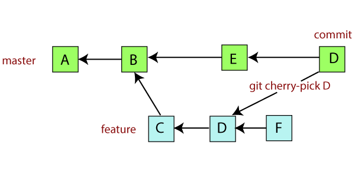
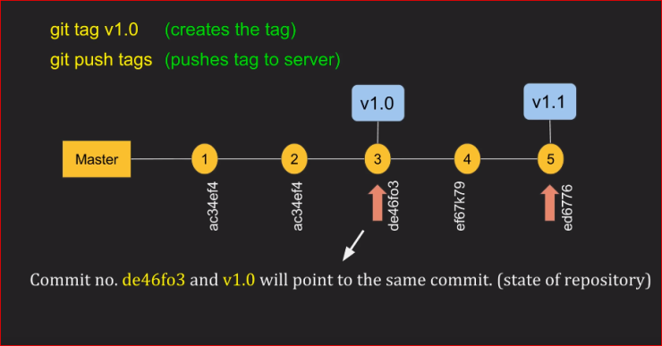

# Cherry Picking 🍒

## What and why is cherry picking?
- Cherry picking allows you to "cherry pick" arbitrary Git commit from one branch and append it to the current working HEAD. It can be useful to help undo changes, or transfer changes from one branch to another. Examples:
    - Let's say you just hotfixed a bug on a certain test branch -- to prevent it from affecting more people, you might choose to cherry pick that change onto the `main` branch to prevent further encounters with it.
    - If a commit/change that affects multiple components is introduced on one dev branch, it may be cherry picked to the other applicable dev branches where the other components are being worked with.
- For FRC, we often cherry pick commits hot fixes for bugs or pertinent feature inclusions from one dev branch to the main working branch, especially during competitions.

## How do I cherry pick? 🧺
- `git checkout <target-branch>` onto the branch that you want to apply the commit
- Take out the commit ID (SHA)^[Think about how commits are identified -- hashes or SHA's!].
    - You can find the commit SHA by running `git log` in the branch that you want to take the commits from.
- Time to cherry pick! `git cherry-pick <commit-hash-1> <commit-hash-2>` (can cherry pick one or more commits, just keep listing the SHAs sequentially)
- Resolve any conflicts you may have with the current branch
- Commit the cherry pick: `git commit`, then push to the repo: `git push origin <target-branch>` (target branch being the branch you want to apply the commit onto.)

# Tagging 🔖

## What and why is tagging?
- Tags serve as a point of reference for specific points in Git history. For FRC purposes, we often use them to version and benchmark the codebase, mainly during competitions. There are both lightweight and annotated tags that are used:
    - Lightweight tags are tags with NO label, and often used as private references to a specific commit or point in commit history.
    - Annotated tags are tags that are stored as full objects and store more metadata with them, like tagger name, email, and date.
- Typically, annotated tags are common and good practice, so that you have a bit more reference data to work with when looking back at these "bookmarks." 

## How do I tag?
- `git tag <tagname>`. This makes a lightweight tag, but to make an annotated tag, you need to do the following `git tag -a <tagname> -m "tag description"`.
    - Example: `git tag -a svrqual04 -m "playoff game 4: fixed overrun issue with color sensor"`
    - Important note: typically, the `<tagname>`'s naming convention is based on the `<comp>qualNN`. Look at the [test cheat sheet for reference.](../test-cheat-sheet.md)
- When you make a tag, Git is going to assume you're tagging the commit that the HEAD is referring to (most recent commit). But, if you want to tag an old commit...
    - Run `git log` to determine the SHA of the commit you want to tag.
    - `git tag -a v## <commit sha>`.
- A few reminders about tagging:
    - You cannot *retag* a commit UNLESS you use the `-f FORCE` option when adding the annotated tag.
        - `git tag -a -f <tagname> <commit sha>`
        - You could also delete the old tag before tagging the old commit again by running `git tag -d <tagname>`.
    - You need to push tags SEPARATELY! `git push origin <tagname>`
- To see the state of a repo @ a tag, `git checkout <tagname>`
    - When you do this, any changes you make based on this state of the repo will be associated with a detached HEAD - this is why it's good practice to make a new branch you're making any changes based on the state of the repo @ a tagged commit.

### Tagging Exercise
- At this point, if you'll followed the instructions from the [branch-setup exercises](../branch-setup/create-a-branch.md), you'll have created a branch and should now have 2 commits.
- Run `git log` to see the commit logs of the branch you're working on. Tag the second to last commit with the following tag: `<firstname> <lastname> <date> - anchor point for practical`.
